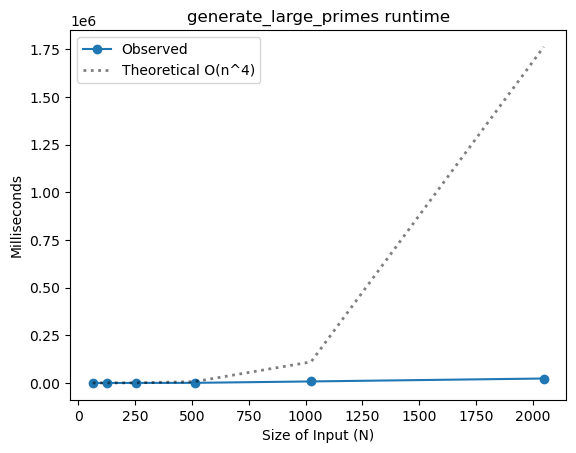
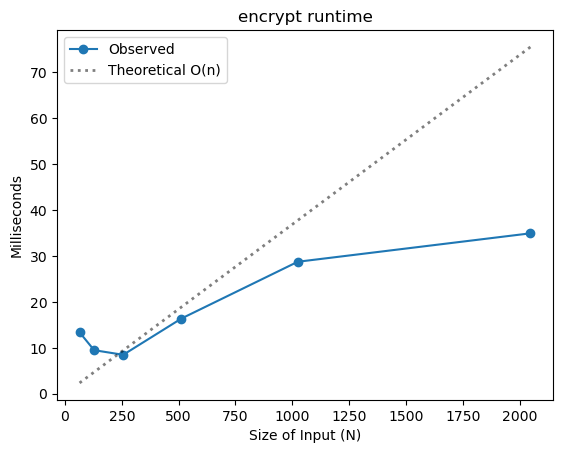
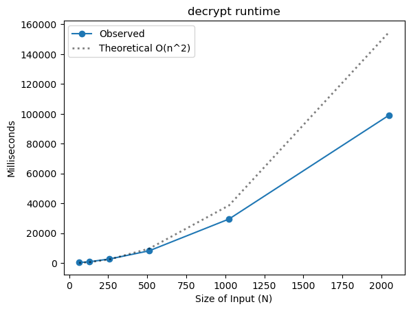

# Project Report - RSA and Primality Tests

## Baseline

### Design Experience

On Sep. 19th, I met with Brandon Monson to discuss the design of the algorithms needed for our RSA project. We reviewed the parameters and return values for each function and how they tie into RSA. For mod_exp(x, y, N), we agreed its purpose is to compute (x^y) mod N efficiently using recursive repeated squaring, and that the return value is the reduced result of that exponentiation. For fermat(N, k) and fermat_once(N), we discussed how the input parameter N is the number to test, k is the number of trials, and the return value is a boolean indicating whether N is probably prime. We also clarified how mod_exp is used inside Fermat’s test. Finally, for generate_large_prime(n_bits), we talked about how the input specifies the bit-length of the desired prime, and the function loops until a candidate passes the Fermat test, returning a large prime suitable for RSA key generation. This discussion helped us both solidify the pseudocode into real implementations and gave us confidence about how these functions connect: mod_exp is the computational engine, Fermat uses it for primality testing, and generate_large_prime repeatedly applies Fermat to generate primes.

### Theoretical Analysis - Prime Number Generation

#### Time

#### mod_exp

```py
def mod_exp(x: int, y: int, N: int) -> int:
    if y == 0:                      #O(1) - comparison is constant
        return 1                    #O(1) - returning is constant

    z = mod_exp(x, y//2, N)         #O(n) - bit shifting means we lose one bit per shift, so this happens n times

    if (y % 2 == 0):                #O(1) - comparison and mod are constant
        return ((z * z) % N)        #O(n^2) - n^2 time complexity for multiplication
    else:
        return ((x * z * z) % N)    #O(n^2) - n^2 time complexity for multiplication
```

The largest operations are the recursive call to get z and the multiplication in the return statement. This results in an overall time complexity of **O(n^3)**.

#### fermat

```py
def fermat(N: int, k: int) -> bool:
    """
    Returns True if N is prime
    """
    if N <= 1:                              #O(1) - comparison is constant
        return True                         #O(1) - returning is constant
    for i in range(k):                      #O(k) - loops k times
        a = random.randint(1, N-1)          #O(<n) - definitely less than n
        if not (mod_exp(a, N-1, N) == 1):   #O(n^3) - mod_exp time complexity dominates constant comparisons
            return False                    #O(1) - returning is constant

    return True                             #O(1) - returning is constant
```

The largest operation is the loop k times calling mod_exp, which turns this function into a time complexity of **O(k \* n^3)**.

#### generate_large_prime

```py
def generate_large_prime(n_bits: int) -> int:
    """Generate a random prime number with the specified bit length"""

    while(True):                        #O(n) - "on average it will halt within O(n) rounds" - Section 1.3.1, Algorithms
        N = random.getrandbits(n_bits)  #O(n) - generating random number is O(n) for bit length n
        if (fermat(N, 20)):             #O(n^3) - n^3 dominates k=20
            return N                    #O(1) - returning is constant
```

The largest operation is the loop n times calling fermat, which turns this function into a time complexity of **O(n^4)**.

#### Space

#### mod_exp

```py
def mod_exp(x: int, y: int, N: int) -> int:
    if y == 0:
        return 1

    z = mod_exp(x, y//2, N)   #O(n) - call stack and then O(n) for storing z

    if (y % 2 == 0):
        return ((z * z) % N)
    else:
        return ((x * z * z) % N)
```

We are not counting the input for the space complexity. The largest space operation is the recursive call to get z. This results in an overall space complexity of **O(n^2)**.

#### fermat

```py
def fermat(N: int, k: int) -> bool:
    """
    Returns True if N is prime
    """
    if N <= 1:
        return True
    for i in range(k):                      #O(k) - k small compared to N, a constant
        a = random.randint(1, N-1)          #O(n) - stores a up to N
        if not (mod_exp(a, N-1, N) == 1):   #O(n^2) - mod_exp space complexity
            return False

    return True
```

We are not counting the input for the space complexity. The largest operation is the loop k times calling mod_exp, which turns this function into a space complexity of **O(n^2)**.

#### generate_large_prime

```py
def generate_large_prime(n_bits: int) -> int:
    """Generate a random prime number with the specified bit length"""

    while(True):                        #O(n) - on average, call stack is n deep (Section 1.3.1, Algorithms)
        N = random.getrandbits(n_bits)  #O(n) - generating random number is constant
        if (fermat(N, 20)):             #O(n/2) - n/2 dominates k=20
            return N                    #O(1) - returning is constant
```

We are not counting the input for space. The largest operation is the loop n times calling fermat, which turns this function into a time complexity of **O(n^2)**.

### Empirical Data

| N    | time (ms)   |
| ---- | ----------- |
| 64   | 0.82521     |
| 128  | 3.7436      |
| 256  | 26.92542    |
| 512  | 415.79199   |
| 1024 | 7792.65637  |
| 2048 | 23121.45476 |

### Comparison of Theoretical and Empirical Results

- Theoretical order of growth: **O(n^4)**
- Measured constant of proportionality for theoretical order: **6.933462328106543e-09**
- Empirical order of growth (if different from theoretical): **O(n^3.7)**
- Measured constant of proportionality for empirical order: **1.0020532362591403e-07**




The theoretical order of growth is significantly larger than the empirical order of growth. This is possibly because the multiplication and division for small numbers might not be the assumed O(n^2), and could be more efficient like O(1) for really small numbers and O(n) for others.

## Core

### Design Experience

On Sep. 19th, I met with Brandon Monson to discuss the design of generate_key_pairs(n_bits) and extended_euclid(a, b). We clarified that generate_key_pairs takes a bit length, generates two primes, computes N and φ, then selects an e coprime with φ and finds d as its modular inverse using extended_euclid. The return values are (N, e, d), which form the RSA keys. For extended_euclid, we agreed it should return coefficients (x, y, gcd) where x*a + y*b = gcd, and that y % φ provides the positive inverse for d. We also noted practical checks like avoiding p == q, using a default e if needed, and verifying correctness with sample encrypt/decrypt tests. This gave us confidence the function connects cleanly with the rest of the RSA pipeline.

### Theoretical Analysis - Key Pair Generation

#### Time

#### extended_euclid

```py
def extended_euclid(a, b) -> tuple[int, int, int]:
    if b == 0:
        return (1, 0, a)
    x, y, d = extended_euclid(b, a % b) # O(n) how likely is b going to be 0?
    q = a // b                          # O(n^2) for division when not by 2
    return (y, x - q * y, d)            # O(n^2) for multiplication
```

The largest operations are the recursive call to get x, y, and d and the multiplication in the return statement. This results in an overall time complexity of **O(n^3)**.

#### generate_key_pairs

```py
def generate_key_pairs(n_bits) -> tuple[int, int, int]:
    """
    Generate RSA public and private key pairs.
    Randomly creates a p and q (two large n-bit primes)
    Computes N = p*q
    Computes e and d such that e*d = 1 mod (p-1)(q-1)
    Return N, e, and d
    """

    p = generate_large_prime(n_bits)            # O(n^4) as stated earlier
    q = generate_large_prime(n_bits)            # O(n^4)

    e_counter = 0

    N = p * q                                   # O(n^2)

    phi = (p - 1) * (q - 1)                     # O(n^2)
    e = primes[e_counter]

    x, y, d_gcd = extended_euclid(phi, e)       # O(n^3)

    while (d_gcd != 1):                         # O(1)
        e_counter += 1
        e = primes[e_counter]
        x, y, d_gcd = extended_euclid(phi, e)   # O(n^3)

    d = y % phi

    return (N, e, d)
```

The largest operations are the calls to generate large primes and to get x, y, and d_gcd in the while loop. This results in an overall time complexity of **O(n^4)**.

#### Space

#### extended_euclid

```py
def extended_euclid(a, b) -> tuple[int, int, int]:
    if b == 0:
        return (1, 0, a)
    x, y, d = extended_euclid(b, a % b)  #O(n) - recursive call stack depth is logarithmic
    q = a // b                           #O(n) - storing q requires n bits
    return (y, x - q * y, d)             #O(n) - storing return values
```

We are not counting the input for the space complexity. The largest space operation is the recursive call stack which has a depth of O(log n) based on Euclidean algorithm properties, and each stack frame stores O(n) bits. This results in an overall space complexity of **O(n^2)**.

#### generate_key_pairs

```py
def generate_key_pairs(n_bits) -> tuple[int, int, int]:
    """
    Generate RSA public and private key pairs.
    Randomly creates a p and q (two large n-bit primes)
    Computes N = p*q
    Computes e and d such that e*d = 1 mod (p-1)(q-1)
    Return N, e, and d
    """

    p = generate_large_prime(n_bits)            #O(n^2) - space from generate_large_prime
    q = generate_large_prime(n_bits)            #O(n^2) - space from generate_large_prime

    e_counter = 0

    N = p * q                                   #O(n) - storing N requires 2n bits
    phi = (p - 1) * (q - 1)                     #O(n) - storing phi requires 2n bits
    e = primes[e_counter]                       #O(1) - e is small

    x, y, d_gcd = extended_euclid(phi, e)       #O(n^2) - from extended_euclid

    while (d_gcd != 1):                         #O(1) - loop iterations typically very few
        e_counter += 1
        e = primes[e_counter]                   #O(1) - e is small
        x, y, d_gcd = extended_euclid(phi, e)   #O(n^2) - from extended_euclid

    d = y % phi                                 #O(n) - storing d requires up to 2n bits

    return (N, e, d)                            #O(n) - returning three large integers
```

We are not counting the input for the space complexity. The largest space operations are storing the large integers N, phi, and d (each about 2n bits), and the space used by extended_euclid. This results in an overall space complexity of **O(n^2)**.

### Empirical Data

| N    | time (ms)    |
| ---- | ------------ |
| 64   | 5.43523      |
| 128  | 16.20483     |
| 256  | 73.86088     |
| 512  | 530.94411    |
| 1024 | 26655.8888   |
| 2048 | 167797.19567 |

### Comparison of Theoretical and Empirical Results

- Theoretical order of growth: **O(n^4)**
- Measured constant of proportionality for theoretical order: **2.381451636199472e-08**
- Empirical order of growth (if different from theoretical): **O(n^3.82)**
- Measured constant of proportionality for empirical order: **6.740673680127171e-08**


The theoretical order of growth is slightly larger than the empirical order of growth. This is possibly because the multiplication and division for small numbers might not be the assumed O(n^2), and could be more efficient like O(1) for really small numbers and O(n) for others.

## Stretch 1

### Design Experience

For stretch 1, I met with Patrick Blood to plan our design. We decided to generate keys with generate_key_pairs, which uses two large primes to build N, computes φ, and finds e and d with extended_euclid. The public key is used for encryption and the private key for decryption. Our main tools are mod_exp for modular exponentiation, Fermat for primality testing, and our prime and key utilities. To measure performance, we timed encryption and decryption on 1Nephi.txt, recorded results, and plotted them to compare with the expected logarithmic complexity, estimating a proportionality constant from runtimes. We also exchanged encrypted files with each other using our public keys, successfully decrypted them, and noted small challenges like aligning file formats.

### Theoretical Analysis - Encrypt and Decrypt

#### Time

!! need help from TA here, r we discussing main or what? and do we need two, one for encrypting and one for decrypting?

#### main (encrypt_decrypt_files.py)

```py
def main(key_file: Path, message_file: Path, output_file: Path):
    """
    Encrypt or decrypt `message_file` and write the result in `output_file`
    """

    n_bytes, N, exponent = read_key(key_file)                #O(n) - reading key file

    input_bytes = message_file.read_bytes()                  #O(m) - where m is file size in bits

    start = time()                                           #O(1) - constant time operation

    result = []                                              #O(1) - initialization
    for chunk in stream_chunks(input_bytes, n_bytes):        #O(m/n) - iterate through chunks of size n
        encrypted_chunk = mod_exp(chunk, exponent, N)        #O(n^3) - mod_exp complexity when decrypting, but when encrypting
                                                             # basically constant recursion so mod_exp really is more like O(n^2)
        encrypted_bytes = to_bytes(encrypted_chunk, n_bytes) #O(n) - converting int to bytes
        result.append(encrypted_bytes)                       #O(1) - amortized constant time

    print(f'{time() - start} seconds elapsed')               #O(1) - constant time operation

    output_file.write_bytes(b''.join(result).rstrip(b'\x00')) #O(m) - joining and writing output
```

The rest of the file is inconsequential. The dominant operation is mod*exp inside the loop. Since it's called O(m/n) times with a complexity of O(n^3) each time, the overall time complexity for decryption is O((m/n) * n^3) = **O(m\*n^2)**. For encrypting, when the exponent is a known and usually small number, time complexity is **O(m\*n)**.

#### Space

#### main (encrypt_decrypt_files.py)

```py
def main(key_file: Path, message_file: Path, output_file: Path):
    """
    Encrypt or decrypt `message_file` and write the result in `output_file`
    """

    n_bytes, N, exponent = read_key(key_file)                #O(n) - storing key values, N is n bits

    input_bytes = message_file.read_bytes()                  #O(m) - storing entire file in memory

    start = time()                                           #O(1) - constant space

    result = []                                              #O(m) - will eventually hold all output
    for chunk in stream_chunks(input_bytes, n_bytes):        #O(n) - each chunk is n bits
        encrypted_chunk = mod_exp(chunk, exponent, N)        #O(n^2) - space from mod_exp function
        encrypted_bytes = to_bytes(encrypted_chunk, n_bytes) #O(n) - storing converted bytes
        result.append(encrypted_bytes)                       #(grows to O(m) over all iterations)

    print(f'{time() - start} seconds elapsed')               #O(1) - constant space

    output_file.write_bytes(b''.join(result).rstrip(b'\x00')) #O(m) - joining creates new string
```

Since we're processing the entire message and storing both input and output in memory, the overall space complexity is **O(m + n²)**.

### Empirical Data

#### Encryption

| N    | time (ms) |
| ---- | --------- |
| 64   | 13.37600  |
| 128  | 9.49025   |
| 256  | 8.48103   |
| 512  | 16.37793  |
| 1024 | 28.74231  |
| 2048 | 34.93714  |

#### Decryption

| N    | time (ms)   |
| ---- | ----------- |
| 64   | 395.66207   |
| 128  | 894.23227   |
| 256  | 2713.40394  |
| 512  | 8215.32679  |
| 1024 | 29534.30200 |
| 2048 | 99064.95285 |

### Comparison of Theoretical and Empirical Results

#### Encryption

- Theoretical order of growth: **O(m\*n)** because we use the same message m for all tests, m becomes insignificant. m is 1045360 bits.
- Measured constant of proportionality for theoretical order: **0.03687751171875**
- Empirical order of growth (if different from theoretical): **N/A**
- Measured constant of proportionality for empirical order: **N/A**



The theoretical order of growth is slightly larger than the empirical order of growth. This is possibly because the multiplication and division for small numbers might not be the assumed O(n^2), and could be more efficient like O(1) for really small numbers and O(n) for others. This causes the observed times to be falling off and not quite keeping up with the theoretical order of growth towards the end.

#### Decryption

- Theoretical order of growth: **O(m\*n^2)** because we use the same message m for all tests, m becomes insignificant. m is 1045360 bits.
- Measured constant of proportionality for theoretical order: **0.03582137597894668**
- Empirical order of growth (if different from theoretical): **N/A**
- Measured constant of proportionality for empirical order: **N/A**



The theoretical and empirical orders of growth are very similar and almost match up perfectly for decryption.

### Encrypting and Decrypting With A Classmate

I encrypted and decrypted a personalized message with Patrick Blood. We both used 512-bit public and private keys, and his message was semi-long, with probably around 100 words in it. Mine was shorter, with 10 words. It was neat to see the jumbled encrypted ASCII turn back into the original message. Originally, Patrick's decryption of my message didn't work, but he debugged his program and got it to work without too much trouble. Once that was cleared up, our encryption and decryption was completely successful.

## Stretch 2

### Design Experience

On Sep. 19th, I met with Brandon Monson to design miller_rabin(N, k). We confirmed inputs N and k, the split N−1 = 2^t \* u with u odd, and using random bases a in [2, N−2]. mod_exp(a, u, N) seeds the witness test, with early accept if x is 1 or N−1, else square up to t−1 times to look for N−1. If none found, composite; otherwise continue. We kept guards for small N and even N, and noted that k trades runtime for error probability. We also discussed using fixed bases for deterministic checks on 64-bit N, and how this slots into generate_large_prime by repeating until a candidate passes.

### Discussion: Probabilistic Natures of Fermat and Miller Rabin

I ran tests on Carmichael numbers (special composite numbers like 561, 1105, and 6601) that are known to fool Fermat's test. These numbers satisfy a^(N-1) ≡ 1 (mod N) for bases coprime to N, which is exactly what Fermat checks for.

#### Fermat Test Results

When testing the Carmichael number 561 with 100 trials:

- With k=1: Fermat wrongly said "prime" 50% of the time
- With k=5: Still wrong 9% of the time
- With k=9: Still wrong 2% of the time

For the larger number 6601 with 1000 trials:

- With k=1: Wrong 79.5% of the time
- With k=10: Still wrong 9.9% of the time

The textbook mentions between Figures 1.7 and 1.8 that for regular composite numbers, Fermat's error probability is at most (1/2)^k. My tests show that for Carmichael numbers, the probability follows roughly (3/4)^k instead, making Fermat's test much less reliable.

#### Miller-Rabin Results

Miller-Rabin did way better on the same numbers:

- For all three Carmichael numbers with k=1: Wrong only 1-3.5% of the time

The textbook notes on page 28 that Miller-Rabin has a maximum error rate of (1/4)^k for any composite number. My tests confirm this - even with k=1, Miller-Rabin correctly identified Carmichael numbers as composite over 96% of the time.

This shows why Miller-Rabin is better for RSA. With k=20 (what we use in our prime generation), the chance of a false positive is astronomically small, whereas Fermat would need much larger k values to achieve similar confidence.

## Project Review

For my project review, I met with Brandon Monson and Porter Schollenberger to compare our code and results. We talked for about 20 minutes and focused on the baseline and core tiers. Each of us had different implementations for functions like modular exponentiation, primality testing, and key generation, so we discussed how our choices affected readability and runtime.

When we compared theoretical analysis, it was clear that all three of us came up with different time and space complexities for the main algorithms. This led to a good discussion about how to justify bounds and where our reasoning diverged. We also compared empirical results and the constants of proportionality we measured. Our runtimes were close, but we each interpreted the scaling behavior differently.

Finally, we shared strategies for the stretch goals. Brandon focused on making mod_exp testing faster, and Porter was confused about the encrypt-decrypt step. I learned clearer ways to explain complexity results and saw how different design choices can still lead to working implementations even if the analysis is not the same.
